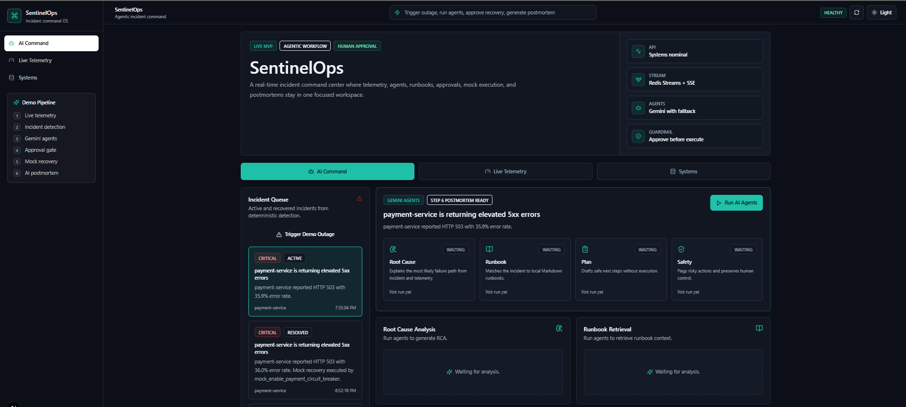
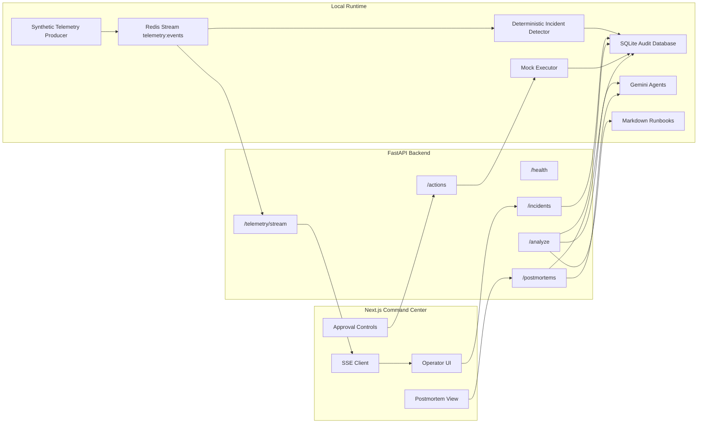
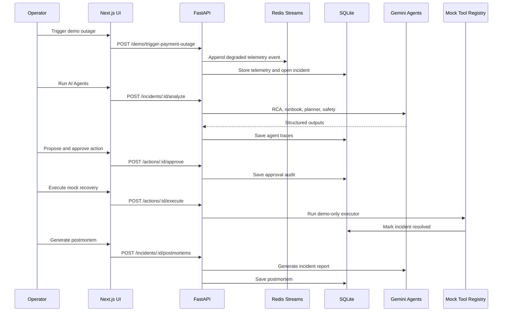
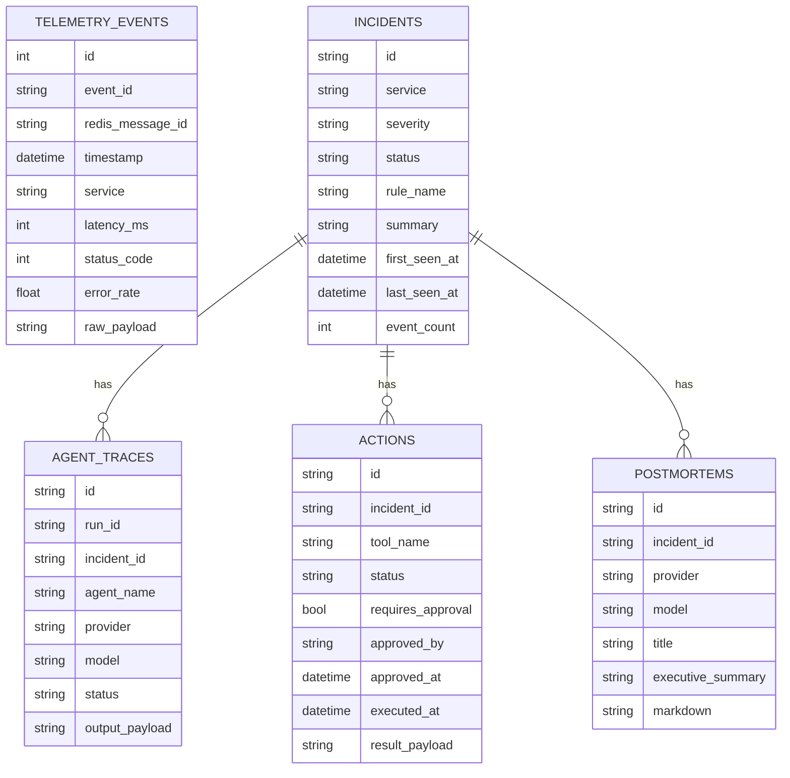
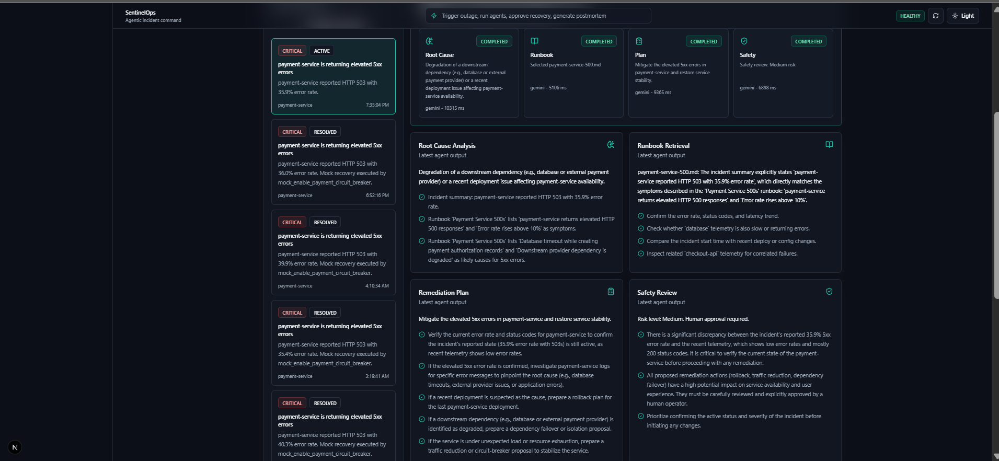
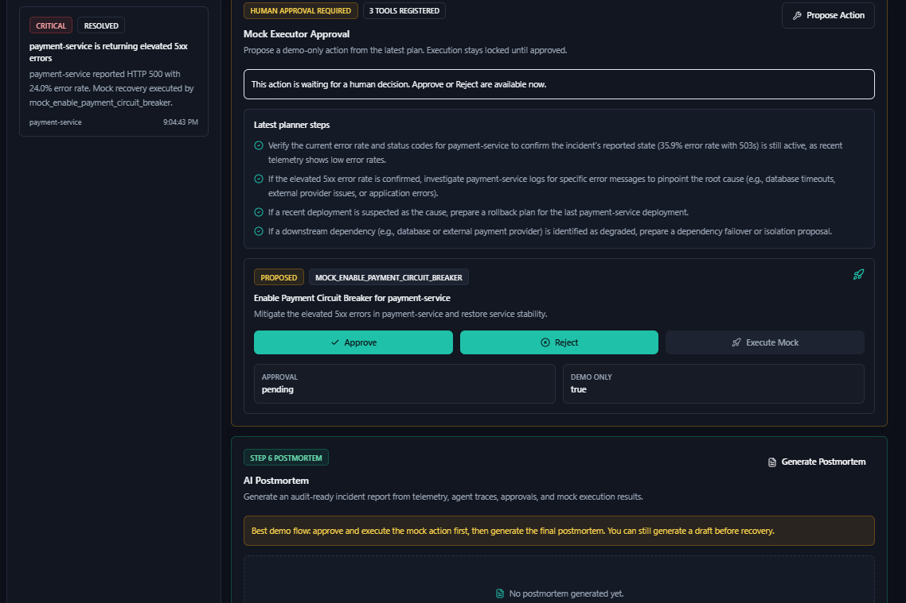
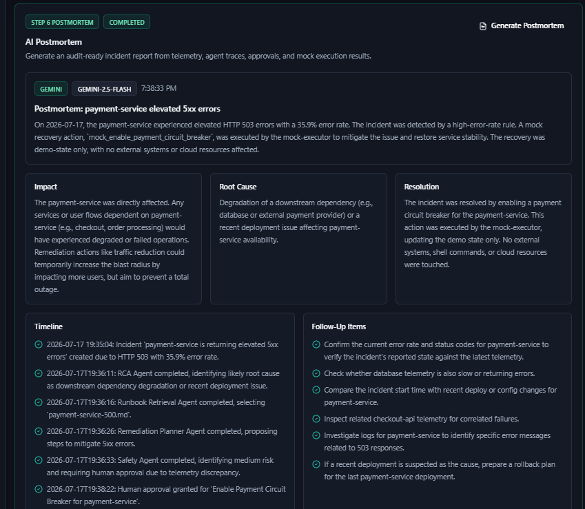
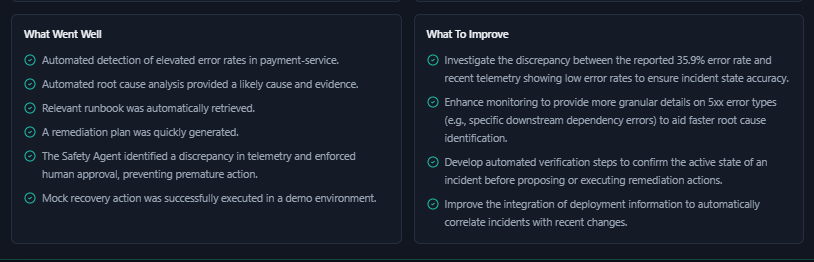
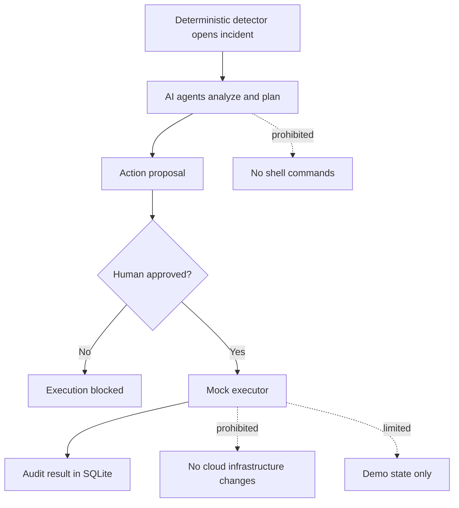

# SentinelOps

Real-time agentic cloud incident commander for detecting service degradation, coordinating AI-assisted incident response, enforcing human approval, and generating postmortems.

SentinelOps is a production-inspired incident response platform built with a Next.js command center, FastAPI backend, Redis Streams telemetry, SQLite audit persistence, Gemini-powered agents, Markdown runbook retrieval, a safety-bounded tool registry, and AI postmortem generation.



## What It Does

SentinelOps simulates the end-to-end workflow of a modern cloud incident:

1. Streams live telemetry from payment-domain services.
2. Detects incidents with deterministic rules.
3. Runs multiple AI agents for RCA, runbook retrieval, remediation planning, and safety review.
4. Requires human approval before any action can execute.
5. Executes only safe demo-state changes through a mock executor.
6. Generates an audit-ready postmortem from telemetry, agent traces, approvals, and execution results.

The system is intentionally safety-bounded. It never executes shell remediation commands, never touches cloud infrastructure, and never gives agents direct authority to modify production systems.

## Key Features

- Real-time telemetry stream using Redis Streams and Server-Sent Events.
- Deterministic incident detection for error rate, latency, CPU, and memory signals.
- Gemini-backed multi-agent workflow with deterministic fallback.
- Local Markdown runbook retrieval for grounded incident reasoning.
- Human-in-the-loop approval gate before mock remediation.
- Tool registry with demo-only safe executor actions.
- SQLite audit trail for telemetry events, incidents, agent traces, actions, and postmortems.
- AI-generated postmortems with timeline, RCA, resolution, lessons learned, and follow-up items.
- Polished dark-mode command center built with Next.js, TypeScript, TailwindCSS, and React Query.

## Tech Stack

| Layer | Technology |
| --- | --- |
| Frontend | Next.js 15, React, TypeScript, TailwindCSS, React Query |
| Backend | FastAPI, Python 3.12, Pydantic, SQLAlchemy |
| Realtime | Redis Streams, Server-Sent Events |
| Database | SQLite for MVP audit persistence |
| AI | Gemini API with structured JSON outputs and deterministic fallback |
| Runbooks | Local Markdown retrieval abstraction |
| Safety | Human approval, mock executor, audit-first design |

## Architecture



## Agent Workflow



## Data Model



## Screenshots

### Command Center

The main dashboard shows the incident queue, active incident, demo pipeline, health status, and AI command workspace.


### Agent Analysis

The RCA, runbook retrieval, remediation planner, and safety agents produce structured outputs that are stored as audit traces.



### Human Approval Gate

SentinelOps blocks execution until a human approves the proposed action. The executor is mock-only and cannot run shell commands.



### AI Postmortem

The postmortem is generated from incident context, telemetry, agent traces, approval records, and the mock execution result.



### Follow-Up Items

The generated report includes operational lessons, follow-up items, and areas for improvement.



## Local Setup

### Requirements

- Node.js
- Python 3.12
- Git
- Redis or Memurai running on `127.0.0.1:6379`

### Environment

Copy the example environment file:

```powershell
Copy-Item .env.example .env
```

Set your Gemini key in `.env`:

```env
LLM_PROVIDER=gemini
GEMINI_MODEL=gemini-2.5-flash
GEMINI_API_KEY=your_key_here
```

The app works without a Gemini key by using deterministic fallback outputs.

### Install

From the repository root:

```powershell
py -3.12 -m venv .venv
.\.venv\Scripts\python.exe -m pip install --upgrade pip
.\.venv\Scripts\python.exe -m pip install -r services\api\requirements.txt
npm.cmd install --prefix apps\web
```

### Run Backend

```powershell
cd services\api
..\..\.venv\Scripts\python.exe -m uvicorn app.main:app --reload --host 0.0.0.0 --port 8000
```

### Run Frontend

In another terminal:

```powershell
npm.cmd --prefix apps\web run dev
```

Open:

- Frontend: `http://localhost:3000`
- Backend health: `http://localhost:8000/health`
- API docs: `http://localhost:8000/docs`

## Demo Flow

1. Open the SentinelOps dashboard.
2. Go to Systems and verify FastAPI, SQLite, and Redis are healthy.
3. Go to Live Telemetry and show real-time service metrics.
4. Go to AI Command and click Trigger Demo Outage.
5. Select the active payment-service incident.
6. Click Run AI Agents.
7. Review RCA, runbook retrieval, remediation plan, and safety review.
8. Click Propose Action.
9. Click Approve.
10. Click Execute Mock.
11. Generate the AI postmortem.

## API Surface

| Endpoint | Purpose |
| --- | --- |
| `GET /health` | Backend, SQLite, and Redis health check |
| `GET /telemetry/stream` | Server-Sent Events telemetry stream |
| `GET /incidents` | List incidents |
| `POST /demo/trigger-payment-outage` | Emit a controlled demo outage |
| `POST /incidents/{incident_id}/analyze` | Run RCA, runbook, planner, and safety agents |
| `GET /incidents/{incident_id}/agent-traces` | Fetch agent audit traces |
| `GET /tools` | List registered demo tools |
| `POST /incidents/{incident_id}/actions/propose` | Propose a safe action |
| `POST /actions/{action_id}/approve` | Human approval |
| `POST /actions/{action_id}/reject` | Human rejection |
| `POST /actions/{action_id}/execute` | Execute mock remediation |
| `POST /incidents/{incident_id}/postmortems` | Generate AI postmortem |

## Deployment Notes

The app can be deployed using a free-friendly split:

- Frontend: Vercel Hobby for Next.js.
- Backend: Render free web service for FastAPI.
- Redis: Upstash Redis free tier.

Render free web services can spin down when idle and have an ephemeral filesystem. For a production deployment, replace SQLite with PostgreSQL. The backend is already structured around SQLAlchemy so the database layer can be swapped without rewriting the API.

See [docs/deployment.md](docs/deployment.md) for details.

## Safety Model




- [Deployment guide](docs/deployment.md)


