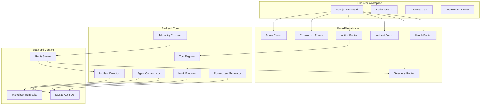
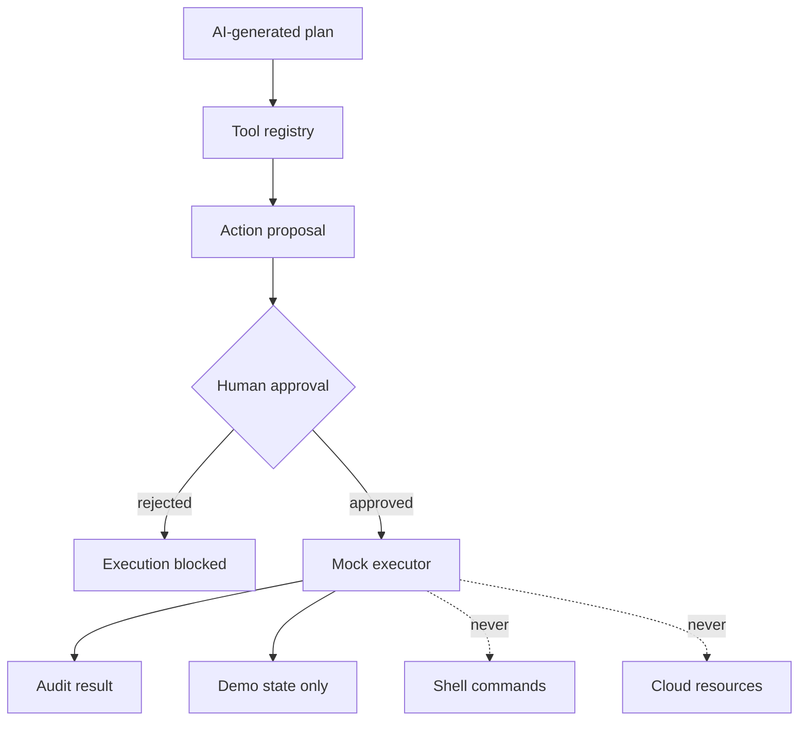
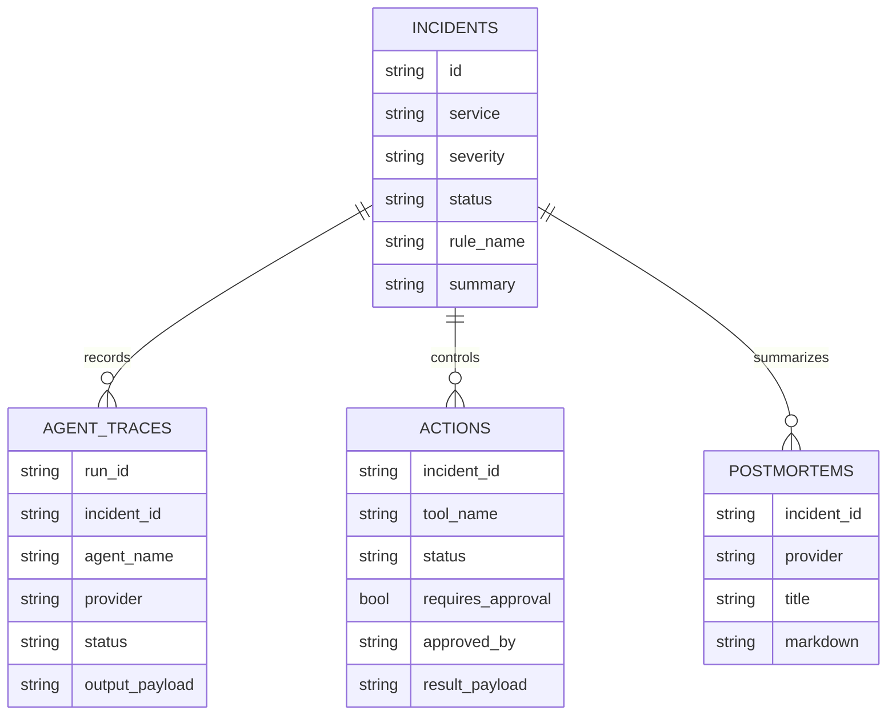

# SentinelOps Architecture

SentinelOps is a modular, production-inspired incident response system. The architecture is intentionally simple enough to run on a laptop while preserving the shape of a larger cloud operations platform.

## System Overview

## Design Goals

- Keep the MVP lightweight enough for local development.
- Preserve production-shaped boundaries between telemetry, detection, agents, tools, and audit records.
- Make AI useful but not authoritative.
- Require human approval before action execution.
- Keep all execution demo-only and auditable.
- Make persistence database-agnostic by using SQLAlchemy.

## Runtime Components

### Frontend

The frontend is a Next.js 15 command center built with TypeScript, TailwindCSS, and React Query.

Responsibilities:

- Display backend, Redis, and SQLite health.
- Subscribe to live telemetry through Server-Sent Events.
- Display active and resolved incidents.
- Trigger controlled demo outages.
- Run AI agent analysis.
- Present RCA, runbook, plan, and safety outputs.
- Propose, approve, reject, and execute mock actions.
- Generate and display AI postmortems.

### Backend

The backend is a single FastAPI application. It owns API routing, background telemetry production, incident detection, agent orchestration, action approval, and postmortem generation.

Key modules:

- `telemetry.py`: synthetic service telemetry and Redis Stream helpers.
- `incidents.py`: deterministic incident detection and SQLite persistence.
- `agentic.py`: Gemini/fallback multi-agent orchestration.
- `actions.py`: tool registry, approval logic, and mock executor.
- `postmortems.py`: postmortem generation from incident context.
- `models.py`: SQLAlchemy audit models.

### Redis Streams

Redis Streams act as the real-time telemetry backbone. Synthetic events are appended to `telemetry:events`; the detector and SSE endpoint consume from the same stream.

This gives the project a realistic event-driven shape without requiring Kafka or a heavy local stack.

### SQLite

SQLite stores audit state for the MVP:

- telemetry events
- incidents
- agent traces
- actions
- postmortems

The code uses SQLAlchemy so SQLite can later be replaced with PostgreSQL.

## AI Agent Architecture

```mermaid
flowchart LR
    Incident["Incident + Telemetry"] --> RCA["RCA Agent"]
    RCA --> Runbook["Runbook Retrieval Agent"]
    Runbook --> Planner["Remediation Planner Agent"]
    Planner --> Safety["Safety Agent"]
    Safety --> Action["Action Proposal"]
    Action --> Approval["Human Approval"]
    Approval --> Executor["Mock Executor"]
    Executor --> Postmortem["Postmortem Agent"]
```

Agents are implemented as plain Python classes/functions, not a heavyweight agent framework. Each agent returns structured JSON and writes an audit trace.

Agent roles:

- RCA Agent: identifies likely root cause and evidence.
- Runbook Retrieval Agent: selects the most relevant Markdown runbook.
- Remediation Planner Agent: proposes safe recovery steps.
- Safety Agent: identifies risks and enforces human approval.
- Postmortem Agent: summarizes the incident lifecycle after recovery.

## Safety Architecture

Safety rules:

- AI can propose actions but cannot execute them.
- Every action requires explicit approval.
- Rejected actions cannot execute.
- Executed actions cannot be approved again.
- The executor only updates SentinelOps demo state.
- No shell commands or cloud resources are touched.

## Persistence Model

## Production Evolution

The MVP is intentionally local-first, but the boundaries support future upgrades:

- SQLite to PostgreSQL.
- Simple Markdown retrieval to vector search.
- Synthetic telemetry to OpenTelemetry, Prometheus, CloudWatch, or Datadog.
- Mock executor to policy-checked runbook automation.
- Local Redis/Memurai to managed Redis.
- Single FastAPI service to separate workers only if scale requires it.
